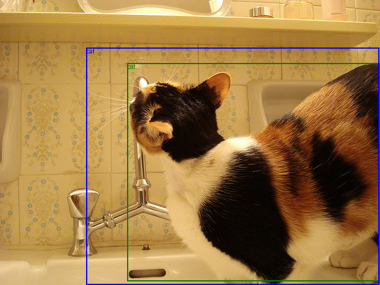
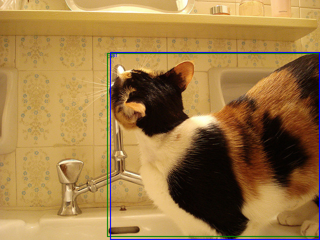
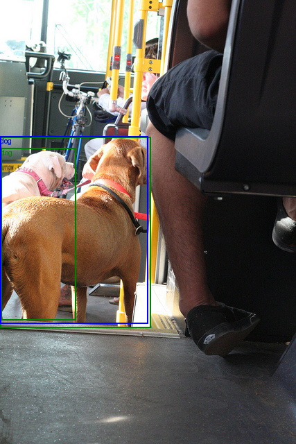
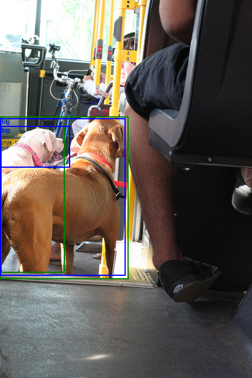

# PaliGemma-Simple

**PaliGemma** is a versatile, open weight Vision-Language Model (VLM) designed for broad knowledge transfer across various tasks. This repository finetune this model on VQA and custom object detction dataset, we also explore working of paliGemma Model an in-depth explanation of the model's architecture and fine-tuning process.

### Video Tutorial

For those who prefer a visual guide, check out our video tutorial ! [here](https://www.youtube.com/watch?v=rw7VUCCeNUA&t=7s).

## Qualitative Results

Visualizations after training on small (5k) dogs and cats **Detection** dataset and testing on some validation dataset, Green boxes are GT and blue boxes are predictions.

**Before Fine-tuning**: On left visualizations of results before fientuning

**After Fine-tuning**: On Right visualizations of results after fientuning

Although pretrained "mix" model of paligemma works quite well for this simple cats/dogs images, in the first image from validation set the bbox becomes more alinged with GT and in second image only one dog is detected (same is true for paligemma2 model) which becomes more accurate after finetuning. Results are just for demonstration purpose of usefulness of finetuning these models  (we only finetune for 2000 steps and only on 1000 images)

 

   
   
 

 

   
   
 

The main purpose of PaliGemma is not Object detection (although it can be fine tune for that purpose and performs reasonably) and if that is the main purpose its best to use OD specific network it will much more efficient and accurate, but it shows how we can fine tune token prediction model for OD also and also add many other tasks.

## How PaliGemma Works?

PaliGemma combines a **SigLIP-So400m** vision encoder with a **Gemma-2B** language model to create a broadly knowledgeable base model that can be effectively transferred to a variety of tasks. The model's architecture consists of three main components:

1. **SigLIP Image Encoder**: Responsible for encoding visual information.
2. **Gemma Language Model**: Handles text understanding and generation.
3. **Linear Connector Layer**: Projects image tokens into the same dimensions as the language model's vocabulary tokens.

### Pretraining Stages

PaliGemma is pretrained in several stages:
- **Unimodal Pretraining**: Training on individual modalities (vision or language).
- **Multimodal Pretraining**: Combining vision and language data for joint training.
- **Resolution Increase**: Enhancing the model's ability to handle higher-resolution images.
- **Task Transfer**: Fine-tuning the model for specific downstream tasks.

## Key Findings from Ablation Studies

The paper includes several ablation studies to analyze the impact of different design choices on the model's performance. Here are the conclusions from each section:

### 1. Pretraining Duration

- Most tasks benefit significantly from longer pretraining.
- **Exception**: Remote sensing tasks, which have a different image distribution, do not benefit as much.

### 2. Masking and Learning Objective

- **Prefix-LM Strategy**: Full attention on input (image and prefix) tokens, autoregressive attention on suffix (output) tokens.
- **Loss Application**: Applying next-token-prediction loss only to the suffix improves average performance.
- **Task-Specific Prefix**: Avoids conflicting learning signals and improves performance.

### 3. Freezing Model Components

- Not freezing any part of the model during multimodal pretraining is advantageous.
- Freezing the image encoder does not significantly affect transfer results.
- Validation perplexity for spatial understanding tasks is improved when the image encoder is not frozen.
- Resetting any part of the model hurts performance.

### 4. Connector Design

- A **linear connector** is preferable to an MLP connector for mapping SigLIP output embeddings to Gemma inputs.

### 5. Image Encoder Choice

- Using a **SigLIP image encoder** is more sample-efficient than passing raw image patches to Gemma.
- Decoder-only VLMs using raw image patches may be promising but lack the training efficiency of models reusing vision components.

### 6. Image Resolution

- Increasing resolution has two effects: increased information content and increased model capacity.
- Both effects contribute roughly equally to gains in tasks benefiting from higher resolution.
- Separate checkpoints for different resolutions are necessary.
- Windowing as an alternative method does not perform better.

This repository aims to provide detailed explanations and fine-tuning scripts for PaliGemma, enabling users to experiment and adapt the model to their specific needs.
